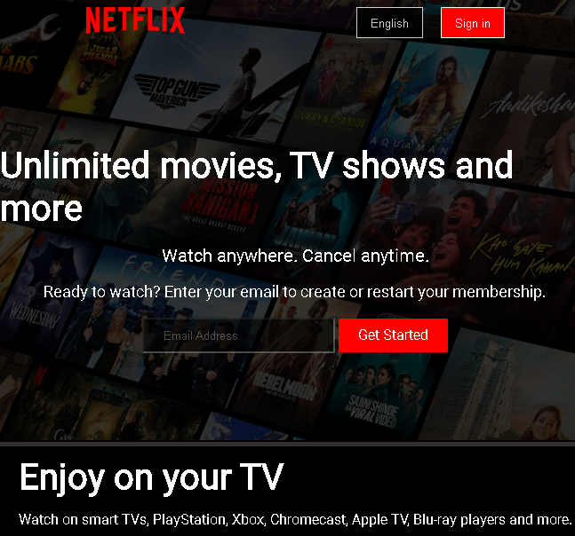
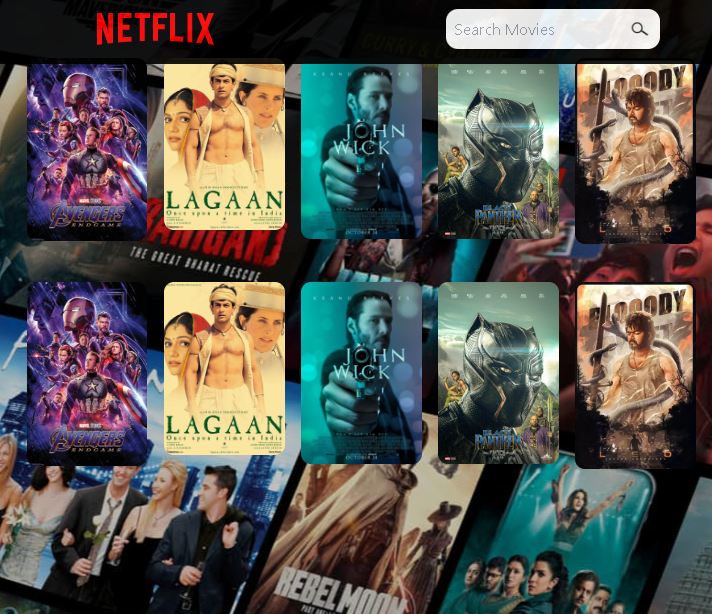
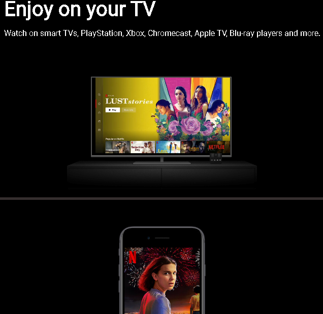

# NETFLIX CLONE

A Simple Netflix  Webpage Clone  Built with  HTML/CSS that is basically a static Webpage.

## Features

- Responsive And Static Webpage

- Click The Get Started Button

## Screenshots

##

##

## Getting Started

 Follow these instructions to get a copy of the project up and running on your local machine.

### Prerequisites

 - VS Code Editor
 - Go Live Extension
 - That two Application Must Be Installed in your System Before Starting The Application

 ### Installing
 1. Clone the repository:

 git clone https://github.com/ssdevloper/Netflix_Clone.git

### Author

Shubham Singh